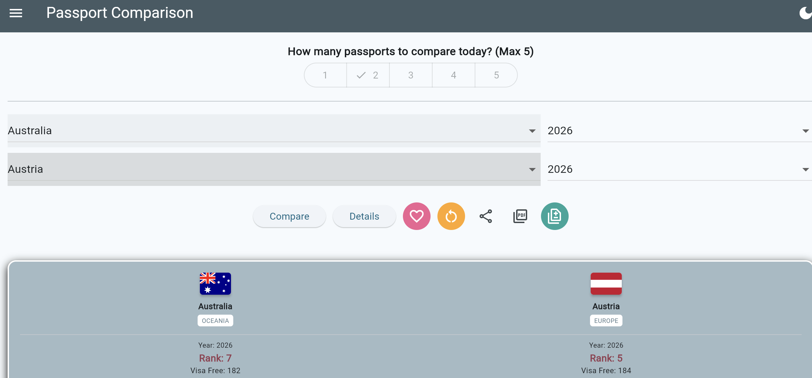
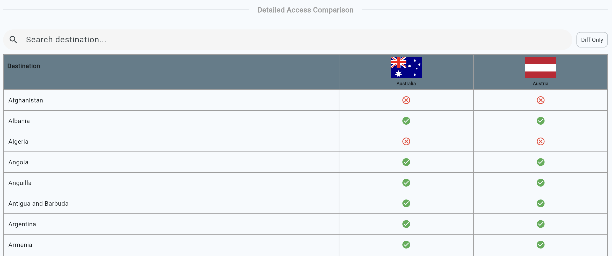
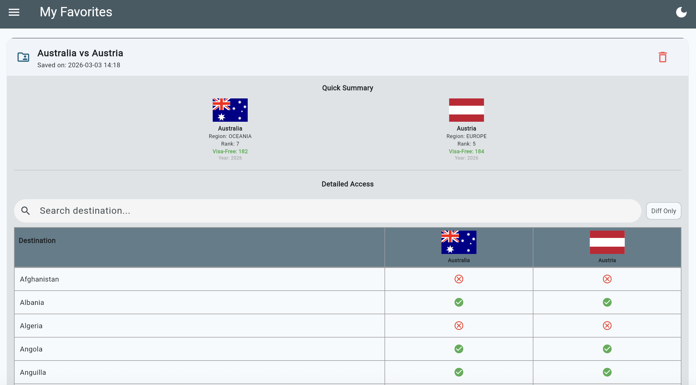

# 🌍 Passport Index Toolbox

A simple passport strength comparison tool built with Flutter. It fetches data via the Passport Index API, supporting comparisons of up to 5 passports, rank tracking, favorite snapshots, and PDF report exports.

## 🎯 Purpose 

The goal of this project is to solve a simple need: **"a simple and straight comparison among passports."** 
This toolbox focuses on a clean, fast, and intuitive interface to compare visa-free access across different countries.

## ✨ Core Features

*   **Multi-Country Sync Comparison**: Compare 1 to 5 passports simultaneously to visualize visa access differences side-by-side.
*   **Historical Data Tracking**: Toggle between different years (from 2006 to present) to observe trends in passport power evolution.
*   **Smart Favorites System**:
    *   **Custom Titles**: Rename comparison sets when saving to your favorites.
    *   **Snapshot Technology**: Automatically encapsulates current rank, region, and visa-free totals during save. This ensures accurate previews even if the API data changes or the device is offline.
*   **Export & Share**:
    *   **Full PDF Reports**: Generate professional documents containing summaries and detailed access lists.
    *   **Diff Only Export**: Specifically filter out countries with identical visa treatments, highlighting only the differences to improve report readability.
    *   **Full-Screen Screenshots**: One-tap capture and sharing of comparison results via the native system share sheet.

## 🛠️ Tech Stack

*   **Framework**: [Flutter](https://flutter.dev) (Channel Stable)
*   **Data Storage**: [SharedPreferences](https://pub.dev) (For local persistence of favorites)
*   **PDF Generation**: [pdf](https://pub.dev) & [printing](https://pub.dev) (Integrated Google Fonts to resolve CJK font missing issues)
*   **Sharing**: [screenshot](https://pub.dev) & [share_plus](https://pub.dev)

## 🚀 Quick Start

### Prerequisites
*   Flutter SDK: `^3.0.0`
*   Dart SDK: `^3.0.0`

### Installation Steps
1. Clone the repository:
   ```bash
   git clone https://github.com

2. Install dependencies:
    ```bash
    flutter pub get

3. Run the app (Web/Chrome):
    ```bash
    flutter run -d chrome

## 📺 Demonstration

### 1. Comparison Flow
Select up to 5 countries and specific years. The tool instantly fetches the Rank and Visa-Free Score. Click **"Details"** to see a full country-by-country access breakdown.
> 
> 

### 2. Favorites & Snapshots
Save frequent comparisons with custom names. 
> 

### 3. Professional PDF Export (Full vs. Diff Only)
Choose between a **Full Report** or a **Difference-Only Report**. The "Diff Only" mode is perfect for travelers who only want to know which destinations require a visa for one passport but not the other.
[View Full Report Sample (PDF)](assets/screenshots/pdf1.pdf)
[View Difference-Only Report Sample (PDF)](assets/screenshots/pdf2.pdf)

### 🔗 Live Demo
[Check out the App here!](https://leo0331.github.io/passportcomparison/)


